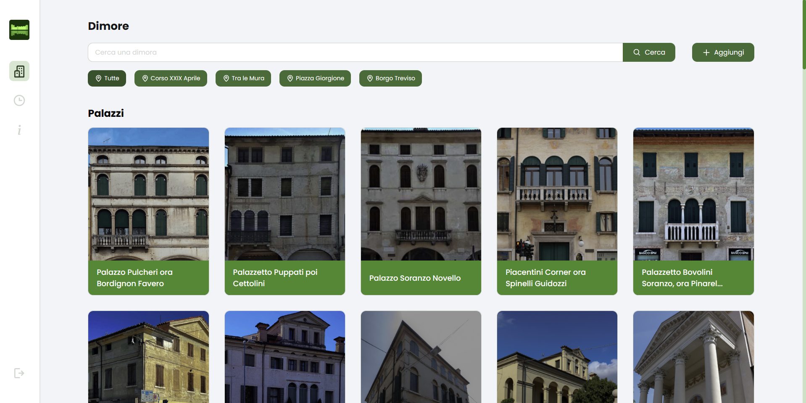

# Castelturismo Dashboard

## Backoffice to manage the data in app

Written with React, Typescript and Sass, this website is used by the proloco of Castelfranco Veneto to add and modify data that is displayed in the [Castelturismo](https://github.com/martinogarrizzo5/castelturismo) Flutter App

### Home Preview

### Path Edit Page Preview

